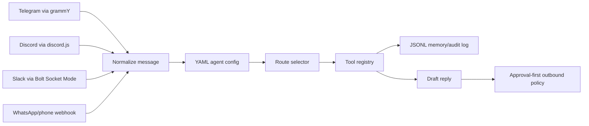

# Channel Agent Runtime

Config-driven messaging agent runtime for Telegram, Discord, and phone/WhatsApp-style gateways.

This is the proper proof asset for bot/operator jobs. It is not a web UI. The interface is channels plus configuration.

## What It Proves

- Agent behavior is defined by YAML config.
- Channels are adapters, not separate apps.
- Bot commands are implemented, not just conversational text handling.
- Telegram can run for real with `grammY`.
- Discord can run for real with `discord.js`.
- Slack can run for real with Bolt Socket Mode once credentials are present.
- WhatsApp is represented as a phone/webhook gateway so it can bind later to Hermes, Twilio, or WhatsApp Cloud API without rewriting the agent.
- Tools are registered once and reused across channels.
- State is written to JSONL for audit/replay.
- Outbound replies are approval-gated by default.

## Why This Is Better Than The Web Demo

The earlier web dashboard demonstrated inspection. This demonstrates operation.

Hiring/client-relevant proof:

```text
message from channel -> normalize -> select route -> run tools -> write memory -> draft/queue reply
```

That is closer to Hermes-style work than a React dashboard.

## Architecture



## Research Notes

- `grammY` is a good Telegram default because it supports Node.js and both polling and webhooks.
- `discord.js` is the standard Node.js Discord bot library.
- `LangGraph` is worth using later for longer-lived, stateful, multi-step agent flows. This scaffold keeps the runtime small first.
- `whatsapp-web.js` is unofficial and browser-session based, so it is not the right professional proof path. Use official WhatsApp Cloud/Twilio/Hermes-style gateways for serious work.

## Run

```bash
cd apps/channel-agent-runtime
npm install
npm run test
npm run simulate
```

Verified locally on 2026-07-18:

```text
Smoke passed: config runtime, phone webhook normalization, Telegram/Slack normalization, routing, tools, and JSONL memory work.
HTTP smoke passed: health, Hermes JSON webhook, Twilio form webhook, and events endpoint work.
OK telegram: bot @yjobiz_bot
OK openrouter: 20 free model(s) visible
OK discord: credentials missing; adapter skipped
OK slack: credentials missing; adapter skipped
```

## HTTP Gateway

Start:

```bash
npm run server
```

Health:

```bash
curl http://127.0.0.1:4337/health
```

Hermes-style normalized payload:

```bash
curl -s -X POST http://127.0.0.1:4337/webhooks/hermes \
  -H 'content-type: application/json' \
  -d '{
    "channel": "whatsapp_phone",
    "from": "+447700900123",
    "name": "Demo Customer",
    "text": "Boiler stopped and we have no hot water today. Can someone come out?"
  }'
```

Twilio-style payload:

```bash
curl -s -X POST http://127.0.0.1:4337/webhooks/whatsapp-phone \
  -H 'content-type: application/x-www-form-urlencoded' \
  --data-urlencode 'From=whatsapp:+447700900123' \
  --data-urlencode 'Body=Can I book an appointment tomorrow?' \
  --data-urlencode 'ProfileName=Demo Customer'
```

Events:

```bash
curl http://127.0.0.1:4337/events
```

## Telegram

Add:

```bash
TELEGRAM_BOT_TOKEN=...
```

Run:

```bash
npm run telegram
```

This starts long polling. For Oracle deployment, a webhook mode can be added behind nginx/Caddy once the public URL is stable.

Live test status:

```text
Telegram long polling tested successfully with @yjobiz_bot.
Inbound Telegram message normalized into the shared runtime.
Route selected: urgent_service.
Outbound status: queued_for_approval.
Bot replied with the approval-gated draft.
```

Commands:

```text
/help
/status
/tools
/routes
/demo urgent
/demo booking
/route <message>
/history 5
```

## Discord

Add:

```bash
DISCORD_BOT_TOKEN=...
DISCORD_CHANNEL_ID=...
```

Run:

```bash
npm run discord
```

The bot ignores messages outside `DISCORD_CHANNEL_ID` when configured.

Commands can use `/help` or `!help`.

## Slack

Add credentials as described in [CHANNEL_SETUP.md](CHANNEL_SETUP.md), then run:

```bash
npm run slack
```

Slack uses Bolt Socket Mode, so no public webhook URL is required for local development.

## Channel Setup

See [CHANNEL_SETUP.md](CHANNEL_SETUP.md) for Telegram, WhatsApp/Twilio, Discord, and Slack credential setup.

## Config

Main agent config:

```text
config/agents/missed-call-recovery.yaml
```

Important fields:

- `policy.auto_reply: false` means replies are drafted/queued, not sent automatically.
- `routes` maps keywords to tool sequences.
- `tools` controls which tools are available.
- `channels` controls active adapters and environment variables.

## Honest Boundary

This is a working scaffold, not a full Hermes replacement.

What works now:

- config loading
- routing
- tool calls
- JSONL memory
- Telegram adapter
- Discord adapter
- HTTP phone/WhatsApp gateway
- simulation and smoke tests

What still needs production work:

- real approval queue persistence beyond JSONL
- provider-specific send workers
- auth on HTTP endpoints
- deployment service file
- LLM provider integration for non-template replies
- database-backed memory

## OpenRouter Drafting

The default config keeps LLM drafting disabled so tests stay deterministic.

For an OpenRouter-backed draft, use:

```bash
node src/cli.mjs simulate --config config/agents/missed-call-recovery-llm.yaml
```

The demo config uses a currently free OpenRouter model:

```text
google/gemma-4-26b-a4b-it:free
```

Observed LLM run:

```json
{
  "route": "urgent_service",
  "approval_required": true,
  "llm": {
    "provider": "openrouter",
    "model": "openrouter/free"
  },
  "reply": "I'm sorry to hear that. To help us arrange a visit, could you please provide your full address and the make/model of your boiler if you have it available?"
}
```

If OpenRouter fails or rate limits, the runtime falls back to deterministic template drafting and records the fallback in tool output.

## Credential Check

Read-only checks performed:

```text
Telegram getMe: ok, bot username yjobiz_bot
OpenRouter models endpoint: ok, free models available
```

Discord was not tested because credentials are not present.

## Test Suite

```bash
npm run test
npm run test:llm
```

`npm run test` covers:

- config/runtime smoke
- bot command smoke
- Telegram payload normalization
- Slack payload normalization
- phone/WhatsApp payload normalization
- route selection
- tool execution
- JSONL memory
- HTTP health endpoint
- Hermes-style JSON webhook
- Twilio-style form webhook
- provider checks for Telegram and OpenRouter

`npm run test:llm` performs a live OpenRouter call and verifies that the reply remains approval-gated.

## Application Proof Line

```text
I built a config-driven channel agent runtime: Telegram via grammY, Discord via discord.js, and a Hermes/Twilio-style phone webhook adapter all feed the same agent loop. The runtime normalizes messages, selects YAML-defined routes, calls tools, writes JSONL memory, and approval-gates outbound replies by default.
```
