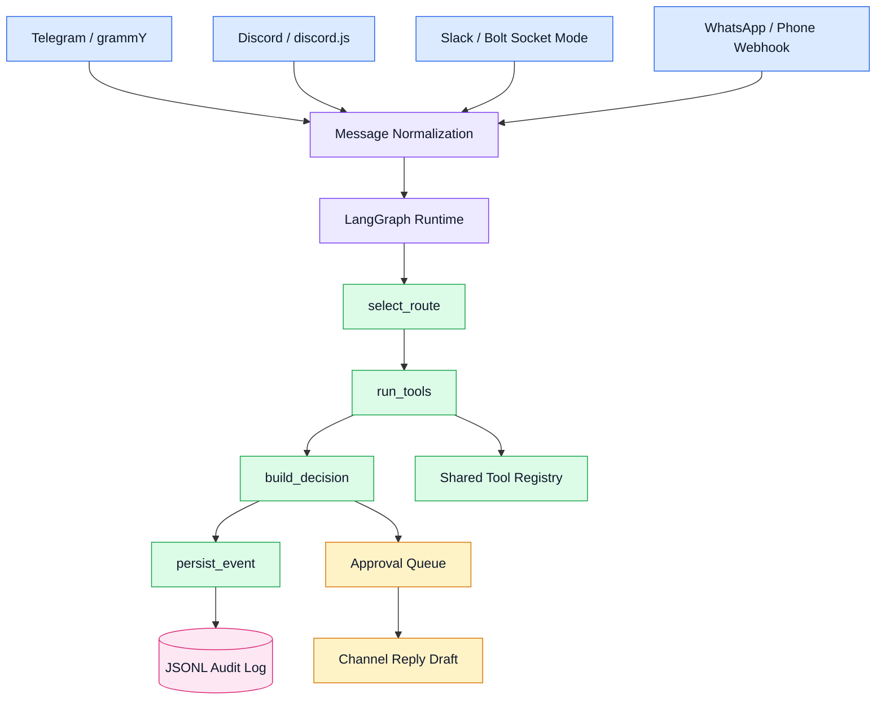

# Channel Agent Runtime

[](https://nodejs.org/)
[](https://langchain-ai.github.io/langgraph/)
[](https://grammy.dev/)
[](https://discord.js.org/)
[](https://slack.dev/bolt-js/)
[](https://developers.facebook.com/docs/whatsapp/)

A config-driven multi-channel agent runtime. Telegram, Discord, Slack, and WhatsApp/phone events normalize into one LangGraph state graph with tools, memory, and approval-first outbound replies.

Built as portfolio proof for bot, operator, and agent-platform roles. Not a web UI — channels are the interface.

## What it proves

| Proof point | Details |
| --- | --- |
| Config-driven behavior | Agent routes, tools, channels, and outbound policy are defined in YAML. |
| Shared runtime | Telegram, Discord, Slack, and WhatsApp-style inputs flow into the same graph. |
| Real channel adapters | Telegram runs through `grammY`; Discord runs through `discord.js`; Slack uses Bolt Socket Mode. |
| WhatsApp-ready gateway | WhatsApp is represented as HTTP webhook normalization for Hermes, Twilio, or Meta Cloud API. |
| Tool reuse | Tools are registered once and reused across channel-specific workflows. |
| Auditability | Events persisted to JSONL for replay and debugging. |
| Approval-first outbound | Drafted replies are queued for approval instead of auto-sending. |
| Testable demos | Salon booking, Discord moderation, Slack triage, and WhatsApp real-estate intake covered by smoke tests. |

## System design



## Channel Status

| Channel | Status | Demo |
|---------|--------|------|
| Telegram | ✅ Live — `@chant_my_bot` polling | `npm run telegram:salon` then message the bot |
| Discord | ✅ Live — bot "Piligrim" | `npm run discord:moderation` |
| Slack | ✅ Live — tokens + channel send work | `npm run slack:workflow` |
| WhatsApp | ⚠️ Webhook handling works, no sender | `npm run simulate:whatsapp` or `npm run server:whatsapp` + curl |
| LLM | ✅ OpenRouter drafting (14 free models) | `npm run simulate:salon-llm` |

## Demo scenarios

| Scenario | Command | Purpose |
| --- | --- | --- |
| Salon Telegram bot | `npm run simulate:salon` / `npm run telegram:salon` | Appointment booking with availability check |
| Discord moderation | `npm run simulate:discord` / `npm run discord:moderation` | Moderation classification + approval-gated actions |
| Slack workflow triage | `npm run simulate:slack` / `npm run slack:workflow` | Priority classification + operator routing |
| Real-estate WhatsApp | `npm run simulate:whatsapp` / `npm run server:whatsapp` | Listing matching + multi-language reply (SK/DE/EN) |
| LLM drafting | `npm run simulate:salon-llm` | Same demos with OpenRouter drafting + fallback |

## Quick start

```bash
npm install
npm run test                   # runs all 5 test suites
npm run simulate               # default missed-call-recovery agent
npm run simulate:salon         # Telegram salon booking demo
npm run simulate:discord       # Discord moderation demo
npm run simulate:whatsapp      # WhatsApp real-estate intake
npm run simulate:slack         # Slack workflow triage
```

## Test output

```
Smoke passed: config runtime, phone webhook normalization, Telegram/Slack normalization,
              routing, tools, and JSONL memory work.
Demo smoke passed: salon Telegram, Discord moderation, Slack workflow, and real-estate
                   WhatsApp scenarios run through LangGraph.
Command smoke passed: help, tools, route, demo, history, lead, book, handoff, and
                      approval commands work.
HTTP smoke passed: health, WhatsApp Cloud verify, Hermes JSON webhook, Twilio form
                   webhook, and events endpoint work.
OK telegram: bot @chant_my_bot
OK openrouter: 14 free model(s) visible
OK discord: bot token validates and channel send proof passed.
OK slack: bot/app/signing credentials present
```

## Application proof line

```
I built a config-driven multi-channel agent runtime in Node.js using LangGraph.
Telegram, Discord, Slack, and WhatsApp-style webhooks all normalize into the same
state graph for route selection, tool execution, decision building, JSONL audit,
and approval-first outbound replies. OpenRouter drafting is optional — LLM failure
falls back to template, not silence.
```

## Configuration

Agent configs in `config/agents/`. Each YAML file defines routes, tools, channels, policy, and optional LLM settings:

```yaml
id: salon-appointment-telegram
mode: approval_first
routes:
  appointment:
    when:
      any: [book, appointment, nails, lashes]
    steps: [extract_appointment_request, check_salon_availability, create_salon_booking, draft_salon_reply]
policy:
  auto_reply: false
llm:
  enabled: false
```

Channel setup instructions in [CHANNEL_SETUP.md](./CHANNEL_SETUP.md). Full demo flows in [DEMO_GUIDE.md](./DEMO_GUIDE.md).

## Honest boundaries

- **Telegram + Discord**: live and testable now
- **Slack**: auth and channel send verified
- **WhatsApp**: inbound webhook handling tested locally. Real sending needs Meta Cloud API, Twilio approved sender, or Hermes gateway
- **LLM drafting**: runs on OpenRouter free-tier — latency and occasional empty completions expected; fallback path makes it acceptable for a demo
- **Memory**: JSONL only (SQLite for real-estate listing data)
- **HTTP endpoints**: no auth — local dev only
- **No deployment service file**: manual start
